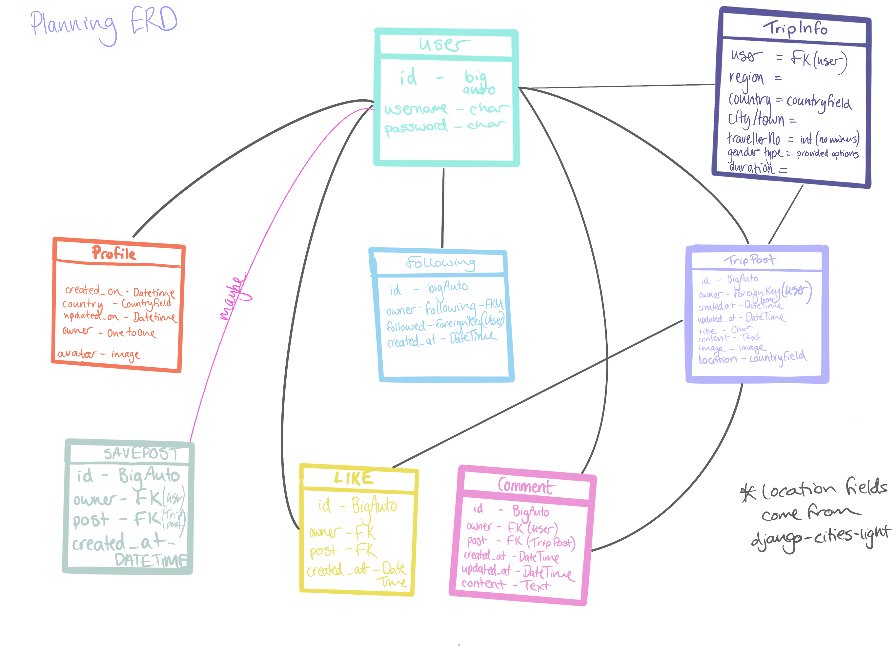
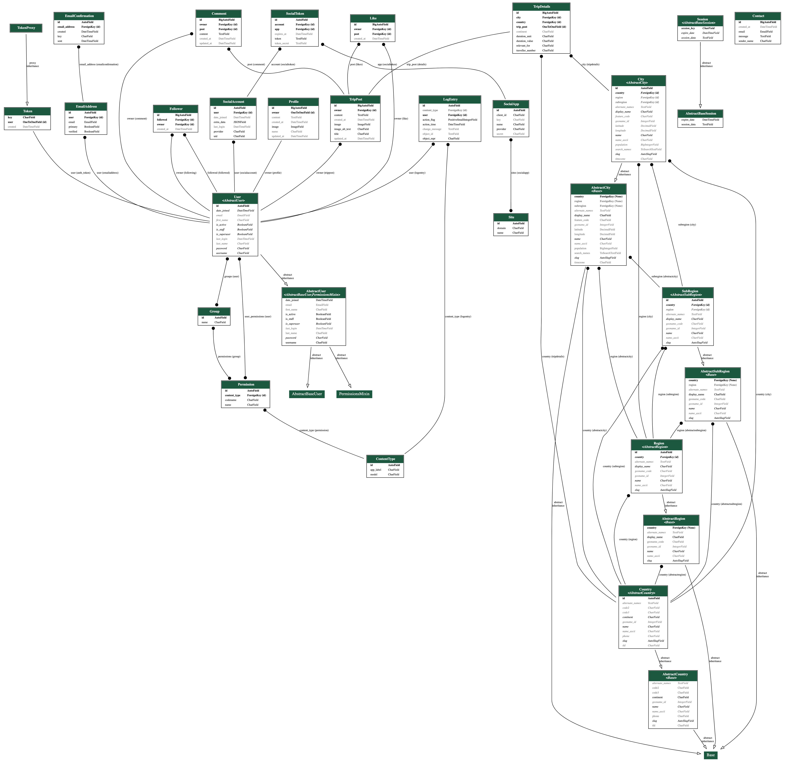
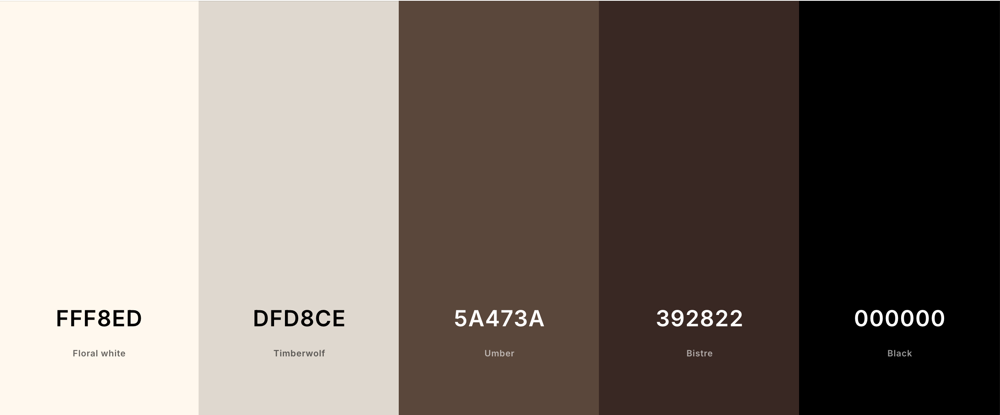

# Nomad Narratives

## Project Introduction

Welcome to Nomad Narratives - a vibrant travel community where adventurers from around the globe can share their unique travel stories, insights, and experiences. Whether you're a seasoned traveler or just beginning to explore the world, this platform is designed for YOU to connect, inspire, and learn from fellow wanderers.

At Nomad Narratives, we believe that every journey is special, and each story holds the power to inspire others. Through our easy-to-use platform, you can share your own travel tales, discover hidden gems, offer travel tips, and connect with like-minded explorers.

Sign up to gain full access to this community-driven space. Once you’re a member, you can contribute your travel stories, engage with others through comments and interact with other users!

## Planning

### Project Inspiration

The idea for this project was born from my own experience while searching for information on multiple locations at once. Just before COVID hit, I decided to travel and live abroad for a year or two. With no specific destination in mind, I began my research. However, I quickly realized that travel content was scattered across various individual websites, making the process incredibly time-consuming.

This challenge was a major factor in my decision to start coding. As someone with a passion for travel who couldn’t justify creating a personal website, I saw a real need for a platform that centralized this type of information created by casual content creators.

### Agile Development
The details of my agile development can be found [here](AGILE.md).

### Strategy
#### Site aims

- **Encourage User Engagement**  
- Enable users to view and leave comments on posts.  
- Allow users to like and follow other users.  
- Provide a way for users to edit and delete their own content.  

- **Content Creation & Sharing**  
- Allow logged-in users to create, edit, and delete posts.  
- Support adding images and trip details to posts.  
- Ensure content moderation by restricting post edits and deletions to their owners.

- **Search & Discovery**  
- Enable users to find posts based on title, country, or city.
- Provide a structured search system to enhance content discoverability.  

- **User Access & Permissions**  
- Restrict content creation and interaction (comments, likes, follows) to logged-in users.  
- Ensure logged-out users are redirected when attempting to access exclusive pages.  
- Prevent users from editing or deleting content that is not their own.  

- **Administrator Control**  
- Allow admin users to manage posts, comments, likes, users, and locations.  
- Ensure admins can receive and respond to user inquiries.

- **Seamless Navigation & User Experience**  
- Provide a welcoming homepage for logged-out users.  
- Redirect users appropriately based on their login status.
- Instantly update follower and like counts for real-time interaction.

#### Opportunities

Below are the main opportunities that arose when planning my project. The scores given to each opportunity were influenced by the project timeframe, familiarity with the languages and frameworks used, and project scope. Opportunities ranked lowly are only done so within the scope of this iteration and will be rescored in future iterations.

Opportunity | Importance | Viability/Feasibility
---|:---:|:---:|
| View comments under a post | 4 | 4 |
| Add a comment to a post | 4 | 4 |
| Edit or update a comment | 4 | 4 |
| Delete a comment | 4 | 4 |
| Restrict commenting for logged-out users | 5 | 5 |
| Restrict viewing comments for logged-out users | 3 | 5 |
| Prevent logged-in users from editing others' comments | 5 | 5 |
| View username and profile image for comments | 4 | 5 |
| Follow/unfollow another user | 2 | 4 |
| View follower counts | 3 | 4 |
| View other users' follower counts | 2 | 4 |
| Real-time follower and following count updates | 3 | 4 |
| Like/unlike a post | 4 | 4 |
| View all posts as a logged-in user | 5 | 5 |
| Restrict post viewing for logged-out users | 4 | 5 |
| Create a post | 5 | 5 |
| Filter posts | 3 | 4 | 
| Restrict post creation for logged-out users | 5 | 5 |
| Edit own posts | 4 | 5 |
| Restrict editing for non-owners | 5 | 5 |
| Delete own posts | 5 | 5 |
| Restrict post deletion for non-owners | 5 | 5 |
| Add an image to a post | 3 | 3 |
| Prevent exceeding image size limits | 3 | 3 |
| Display error message for oversized images | 5 | 5 |
| Add trip details to posts | 4 | 4 |
| Search for posts by title, country, or city | 4 | 4 |
| Receive messages from users | 1 | 1 |
| Control available cities and countries | 5 |5  |
| Add cities and countries to the database (admin) | 5 | 5 |
| View all registered users (admin) | 5 | 5 |
| Manage user profiles (edit, delete, create) (admin) | 5 | 5 |
| View sign in and sign up as logged-out user | 5 | 5 |
| Restrict sign-in and sign-up pages once logged in | 5 | 5 |
| Redirect logged-out users when accessing exclusive pages | 4 | 5 |
| Contact form to allow users to chat to admin | 4 | 5 |
| No page refresh when navigating between pages. | 3 | 4 |

| Rich text editor for posts | 2 | 1 |
| Clickable links for content filters | 2 | 2 |
| Tags for categorizing posts | 1 | 1 |
| New detail category for trip types | 1 | 1 |
| Save posts to a folder | 2 | 1 |
| Dropdown for predefined categories | 3 | 1 |
| Library of profile images | 1 | 1 |
| 'Helpful tips' page for writing posts | 1 | 1 |
| Post collaborations | 1 | 1 |
| Social media sharing buttons | 1 | 1 |
| Comment moderation system | 3 | 1 |
| Multi-language support | 3 | 1 |
| Dark mode color scheme | 1 | 1 |
| Email validation for users | 3 | 1 |
| My Feed page auto-refresh | 3 | 1 |
| **TOTAL SCORES** | 137 | 143 |

### Scope

I divided these opportunities into categories under the MoSCoW headings for clarity. These headings have also been linked to the user stories and acceptance criteria on my [GitHub project](https://github.com/users/maevecrossan/projects/5).

*Note: Not all the above headings have been included for the sake of brevity. An extensive list of user stories and their acceptance criteria can be found [here](https://github.com/users/maevecrossan/projects/5). Each story will have a MoSCoW heading as a tag.*

* **Must Have:**
	* User sign up and sign in.
	* See logged in-out status.
	* View, add, edit and delete posts (logged in users).
	* Website introduction.

* **Should Have:**
	* Users can follow and unfollow other users.
	* View, add, edit and delete comments (logged in users).
	* User can like/unlike a post.
	* No page refresh when navigating pages.

* **Could Have:**
	* Contact (admin) form.
	* Filter posts (most recent, followed users, likes, saves).
	* View user profiles.

* **Won't Have:**
	* Rich text editor for posts
	* Clickable links for content filters
	* Tags for categorizing posts
	* New detail category for trip types
	* Save posts to a folder
	* Dropdown for predefined categories
	* Library of profile images
	* 'Helpful tips' page for writing posts
	* Post collaborations
	* Social media sharing buttons
	* Comment moderation system
	* Email validation for users

### Structure

#### User Stories

##### Nomad Narratives User
| # | User Story |
| :-- | :-- |
| 1. | As a logged in user, I can see comments under a post so that I can engage with the content and see others’ opinions. |
| 2. | As a logged in user, I can add a comment to a post so that I can participate in the discussion. |
| 3. | As a logged in user, I can edit or update my comment so that I can correct or improve my response. |
| 4. | As a logged in user, I can delete my comment so that I can remove it if I no longer wish to participate in the conversation. |
| 5. | As a logged out user, I cannot add a comment to a post so that content creation is reserved for logged in users. |
| 6. | As a logged out user, I cannot see comments under a post so that I am prompted to log in to engage with content. |
| 7. | As a logged out user, I cannot edit another user's comment so that only the original author can modify their own contributions. |
| 8. | As a logged in user, I cannot edit another user's comment so that content moderation is properly managed. |
| 9. | As a logged in user, I can see the username and profile image of the person who wrote the comment so that I can identify them. |
| 10. | As a logged in user, I can follow another user so that I can keep track of their posts and updates. |
| 11. | As a logged in user, I can unfollow a user so that I can stop receiving updates from them. |
| 12. | As a logged out user, I cannot follow another user so that following is reserved for logged in users. |
| 13. | As a logged out user, I cannot unfollow another user so that following management is exclusive to logged in users. |
| 14. | As a logged in user, I cannot follow myself so that there is no redundancy in following actions. |
| 15. | As a logged in user, I can see how many followers I have so that I can track my community.|
| 16. | As a logged in user, I can see how many followers another user has so that I can compare community sizes.|
| 17. | As a logged in user, my follower and following counts are updated instantly when someone follows or unfollows me so that my profile reflects the most current information.|
| 18. | As a logged in user, I can like a post by another user so that I can show appreciation for their content.|
| 19. | As a logged in user, I can unlike a post I previously liked so that I can change my opinion. |
| 20. | As a logged in user, I cannot like a post I previously liked again so that the system only allows one like per post. |
| 21. | As a logged out user, I cannot like or unlike posts so that interacting with content is restricted to logged in users. |
| 22. | As a logged in user, I can view all posts so that I can browse the content freely.|
| 23. | As a logged out user, I cannot see all posts so that access to posts is restricted to logged in users.|
| 24. | As a logged in user, I can create a post so that I can contribute to the platform’s content. |
| 25. | As a logged out user, I cannot create a post so that post creation is reserved for logged in users. |
| 26. | As a logged in user, I can edit a post I own so that I can update or improve my content.|
| 27. | As a logged in user, I cannot edit a post I don’t own so that post editing is restricted to the author.|
| 28. | As a logged out user, I cannot edit a post so that only logged in users can make changes to posts.|
| 29. | As a logged in user, I can delete a post I own so that I can remove content I no longer want to share.|
| 30. | As a logged in user, I cannot delete a post I don’t own so that content removal is reserved for the author.|
| 31. | As a logged in user, I can add an image to a post as long as it meets the size criteria so that I can enrich my post with media.|
| 32. | As a logged in user, I cannot add an image exceeding the size limit so that I comply with upload restrictions.|
| 33. | As a logged in user, I can see an error message if I attempt to upload an image exceeding the size limit so that I am informed of the issue.|
| 34. | As a logged in user, I can add trip details to my post so that my audience understands the context and specifics of my content.|
| 35. | As a logged in user, I can see comments made under posts to engage with other users' feedback.|
| 36. | As a logged in user, I can find posts in search results if their title matches my query so that I can easily find relevant content.|
| 37. | As a logged in user, I can find posts in search results if their country matches my query so that I can find location-specific posts.|
| 38. | As a logged in user, I can find posts in search results if their city matches my query so that I can find city-specific content.|

##### Administrator User Stories
| # | User Story |
| :-- | :-- |
| 1. | As an admin user, I can receive messages from both logged in and logged out users so that I can address their inquiries or concerns. |
| 2. | As an admin I can control what cities and countries are available to users. |
| 3. | As an admin user, I can add cities and countries to the database to fill in any gaps. |
| 4. | As an admin user, I can edit, delete and create posts. |
| 5. | As an admin user, I can edit, delete and create comments. |
| 6. | As an admin user, I can delete and create likes. |
| 7. | As an admin user, I can see all registered users. |
| 7. | As an admin user, I can see, edit, delete and create user profiles. |

##### User Redirection 
| # | User Story |
| :-- | :-- |
| 1. | As a logged out user, I can view the welcome page, sign in, sign up, and contact forms so that I can start engaging with the platform. |
| 2. | As a logged in user, I can view the welcome page, sign in, sign up, and contact forms so that I can interact with the platform easily. |
| 3. | As a logged in user, once loged in, I cannot view the sign in and sign up so that I can stay signed in. |
| 4. | As a logged out user, I am redirected to the homepage when trying to access user-exclusive pages (e.g. new post, feed, likes, comments) so that content is restricted to logged in users. |

### Skeleton
#### Wireframes

A pdf of my wireframes can be found [here](documentation/features/nn-wireframes-schema.pdf). Detailed schema has been included where used.

#### Data Architecture

Below is the ERD for my database schema at the beginning of my planning.

Here is my final database ERD:

[Link Final ERD File (zoomable)](documentation/data-architecture/final-erd-graphviz.png)

### Surface
#### **Colour Scheme**

Below is a palette of the main colours used in this project. These colours were carefully selected to help define the visual identity of the brand, to ensure consistency across all elements, and to help maintain a cohesive and aesthetically pleasing look.

#### **Fonts**

This project utilises Google Fonts, specifically [`Roboto`](https://fonts.google.com/specimen/Roboto) and [`DM Serif Display`](https://fonts.google.com/specimen/DM+Serif+Display). Roboto provides a modern, clean, and highly readable sans-serif style, ideal for body text and general content. Meanwhile, DM Serif Display adds a touch of elegance and sophistication with its classic serif design, making it perfect for headings and emphasis.

#### **Images**

The images used in this project are primarily my own, except for the user profile avatars. To ensure a realistic user experience, I tested the avatar functionality by using web-sourced images, simulating how a typical user might select their profile picture.

My own images were exported using Adobe Lightroom.

## UX
### Target Audience

Nomad Narratives is a platform designed for travel enthusiasts who want to share and discover travel experiences through blog-style posts. It caters to:

* **Frequent travelers** who want to document their journeys and offer insights to others.

* **Aspiring travelers** looking for destination inspiration and practical tips.

* **Backpackers** and budget travelers seeking real-world experiences from like-minded individuals.

* **Content creators** and travel bloggers who want a community-driven space to share their stories.

The platform encourages interaction through comments, likes, and follows, fostering an engaged community of travelers.

## Testing
The details for my testing can be found here in [TESTING.md](TESTING.md).

## Features

The following is a breakdown of the features of each page of the project.

### NavBar Component
The navigation bar component sits at the top of the window on every page of the application. It is fully responsive and collapses to a burger menu on smaller screens where navigation links stack vertically. The logo remains in the top left for all screens and acts as a route back to the welcome page.

The navigation bar links render conditionally based on the user's authentication status. If they are logged out, they cannot make or view posts, comments or likes. They will only see links for the welcome page, about us and community guidelines sections, sign in and sign up links, and the contact us form.
However, if a user is logged in, they can view all of these links (except for the sign in and sign up pages) as well as the new post, explore, my feed, my likes and sign out links. If a logged out user tries to access these pages, they would be redirected to the homepage.

The navlinks have hover and active styles to help users identify what page they are about to select and are currently on.

### Welcome Page
The welcome page serves as a simple homepage, structured into four main sections: the hero, about us, gallery row, and community guidelines.

The hero section welcomes to user to the website and hooks them in with the 'Where will your next story take you?' question. The background image is of a dark, foggy forest.

If a user clicks on the 'about us' or 'community guidelines' navlinks, they will be automatically scrolled down to that section. This action will happen if clicking those navlinks from any page.

The 'about us' section gives a concise explanation of the website's purpose. It also houses a link to the sign up page should the user choose to do so.

Next is the gallery row which, on larger screens, houses three images (one vertical, two stacked horizontally). On smaller screens, the larger vertical image is hidden so users can access the Community Guidelines section more quickly.

The community guidelines section outlines the community values and expectations for users.

The 'About Us' and 'Community Guidelines' sections are accessible from the navbar for logged out users.

### Sign Up Page
The sign up page has very minimal design to avoid visually overwhelming the user. The form fields are positioned in front of a photograph. 

Users must enter a username and confirm their password by entering it twice. An error message appears if any of the three fields contain invalid or missing information. Users must agree to the community guidelines to proceed. There is a link below the agreement that users can visit to view the community guidelines. It opens in a new tab so users don't lose progress. Upon successful submission, users are redirected to the sign-in page.

This page is inaccessible to logged-in or authorised users

### Sign In Page
The sign-in page has a similar layout to the sign-up page but features a different background image.

The page includes fields for a username and password, which only accept valid inputs. If a user enters invalid credentials or leaves a required field empty, an error message will be displayed under the relevant field(s).

Below the sign-in button, there is a prompt encouraging users to sign up if they do not have an account. Additionally, if a user forgets their password, there should be an option to reset it.

If a logged-in user tries to access this page, they will be redirected.

### Contact Us Page
The contact page follows the same style as the sign-in and sign-up pages, featuring a clean and minimal design. It is accessible to all users, whether they are logged in or not.

Users must enter their name, email, and a message. If any of these fields contain invalid or missing information, an error message will be displayed under the relevant field(s).

Upon successful submission, a confirmation message will appear to inform the user that their message has been sent. The submitted data will be stored and made visible in the admin panel for staff users to review.

### New Post Page
The new post page is accessible only to authorised users. If an unauthorized user attempts to access it, they will be redirected to the welcome page.

This page contains a form that allows users to create their own posts. All fields in the form are required. If any field contains invalid or missing information, an error message will be displayed under the relevant field(s).

Form Inputs:
Image Upload: A clickable icon positioned to the left of the main form where users can upload a valid image. If the uploaded image exceeds the allowed size, an error message will appear.

* Title: A small text field.

* Content: A larger text field for the main post content.

* Country: A dropdown list of countries.

* City: A dropdown list of cities, filtered based on the selected country.

* Traveller Number: A dropdown list of numbers up to 10.

* Relevant For: A dropdown list of predetermined options specifying who the post is relevant for.

* Duration Value: A dropdown list of numbers up to 10.

* Image Description: A small text field for describing the uploaded image.

Above the country select field, a message contains a link to the contact page. Users are encouraged to send a message to the admin if they notice a missing country or city or encounter any issues.

The Duration Value and Duration Unit fields each have tooltips that appear when hovering over the '!' icon, explaining what type of input is expected.

If the user decides not to create a post, they can click the "Cancel" button to return to the previous page they were on. If they submit a valid post form, they will be redirected to the post page, where they can view their full published post.

### Explore
The Explore page is a dedicated space where users can browse articles from all members of the community. Accessible only to authorized users, it ensures that only logged-in members can interact with the content. If an unauthorized user attempts to access this page, they will be redirected to the welcome page.

At the top of the page, a search bar allows users to quickly find specific posts, authors, or destinations. Just below the search bar, a brief message provides context on the posts being displayed. Articles are arranged in descending order, with the most recent posts appearing first. To enhance user experience, only previews of articles are shown, ensuring smooth scrolling and quick access to key information. Each post preview includes the author's name, title, location, publication date, number of travelers, relevance category, trip duration, and a short excerpt of the content. Users can also see the number of likes and comments each post has received.

For those interested in reading a full article, a "Read More" link is provided beneath each preview. Additionally, users can engage with posts directly from the preview by liking them—where a red heart indicates a liked post and a grey heart shows an unliked one. Clicking on the comment bubble will take users to the comments section for that particular post.

To the right of the posts, a Popular Profiles section showcases the top 10 most-followed users, offering a way to discover influential contributors. These design and interaction elements remain consistent across the Explore, My Feed, and My Likes pages, ensuring a seamless browsing experience across the platform.

### My Feed
The My Feed page functions similarly to the Explore page but exclusively displays posts created by users that the currently logged-in user follows. Below the search bar, a message provides context on the displayed posts.

If the user is not following anyone, they will see a "No Results" message, which states: "Hmm... no results for that. Please try another search term, or try following a user and refresh this page!" This ensures clarity on why no posts are visible and encourages engagement with other users.

For a full breakdown of features, refer to the Explore page.

### My Likes
The My Likes page also mirrors the Explore page but exclusively features posts that the currently logged-in user has liked. Below the search bar, a message provides context on the displayed posts.

If the user has not yet liked any posts, they will see a "No Results" message, which states: "Hmm... no results for that. Please try another search term or try liking a post." This serves as a prompt to encourage interaction with content on the platform.

For a complete list of features, refer to the Explore page.

### Post Page
The Trip Post Page is where users can view the full content of a specific post by clicking on the "read more" link. If the user is the author of the post, they will see a three-dot dropdown menu next to the post. This menu allows them to either edit or delete their post. The reason for showing the three dots only after the user has viewed the full post is to ensure they are aware of the content before making any changes. Clicking the "edit" option will redirect the user to the post creation page, where their post content will be prepopulated in the form. If they choose to delete the post, a confirmation modal will appear to prevent accidental deletion.

Next to the three-dot menu, the post's creation date is displayed. If the post is edited, this date will update to reflect the new updated_at timestamp.

All users, regardless of whether they are the author, can view the comments made on the post by others. The comments are displayed below the post content, and users can add their own comments if they are logged in. The CommentCreateForm allows authenticated users to create comments, while unauthenticated users will only be able to view the comments.

The page also includes an Infinite Scroll feature, which loads more comments as the user scrolls down. If there are no comments, a message will prompt users to be the first to comment.

The right sidebar displays Popular Profiles, showing the top 10 users based on their follower count. These profiles are visible on both mobile and desktop views, ensuring consistency across different screen sizes.

This page provides users with a comprehensive view of the post, comments, and interaction options.

### Sign Out
The Sign Out Modal appears when the user clicks the "Sign Out" navigation link. This modal provides a confirmation message to ensure that users are certain they want to sign out. The modal can be dismissed in several ways: by clicking the 'X' in the top corner, pressing the 'Cancel' button, or by clicking anywhere outside the modal.

If the user confirms their intent to sign out, they will be redirected to the welcome page. This modal ensures that users don't accidentally sign out without meaning to, providing a simple and user-friendly way to confirm their action.

## Deployment

Steps followed for deployment can be found [here](DEPLOYMENT.md).

## Future Developments

Below is a list of future developments I noted down during planning and over the course of development.

| **Future Developments** |
| :----------------------------------------------------------------------------- |
| **Rich text editor** to allow users to have more control over how their content looks. Allow them to select a blog post cover photo and then add additional photos throughout the article for visual aids. |
| **Clickable links** on details to allow users to filter content based on the number of travellers, 'relevant for' group, location, etc. |
| **Tags** to help users further identify what categories, locations, etc. are associated with their blog post. |
| **Create a new detail category** to allow users to quickly demonstrate to readers what type of holiday it is. For example, a city break, backpacking, family trip, girls trip, wedding, etc. |
| **Allow users to save a post** to a folder. This would allow users to organise their favourite posts so that they can refer to them again at a later date. |
| **Create a dropdown in the nav menu** that displays predefined categories through which users can find content. For example, continent, country, city, number of travellers, etc. |
| Create a library of profile images that a user can choose from if they don't have one of their own. |
| **Create a 'helpful tips' page** that gives users guidance on how to write a good, helpful article. |
| **Enable post collaborations** so multiple users can contribute to the same blog post, sharing insights from different perspectives. |
| **Add social media sharing buttons** so users can easily share posts on platforms like Facebook, Twitter, Instagram, etc. |
| **Implement a comment moderation system** so users can report inappropriate comments and ensure a friendly, respectful community. |
| **Add a multi-language option** so users can view content in various languages, making the platform accessible to a global audience. |
| **Add a dark-mode colour scheme** so that users reading in low light can continue to enjoy content. |
| **Email Validation** so that users can be verified. |
| **My Feed page refresh** so that users don't have to do it manually and can begin browsing articles. |

## Credits

### Resources

#### Tech Used

Below is a list of the tech used in this project.

##### Requirements

| **Package**                | **Description**                                                                 |
| -------------------------- | ------------------------------------------------------------------------------- |
| `asgiref`                  | Provides support for ASGI (Asynchronous Server Gateway Interface) applications, handling the interface between web servers and Django apps. |
| `astroid`                  | A library that provides static code analysis of Python code and is used by tools like pylint for linting. |
| `bleach`                   | A library for sanitizing and cleaning HTML, ensuring that content is safe to display on a webpage. |
| `certifi`                  | A collection of Root Certificates for validating the trustworthiness of SSL certificates, used in HTTP requests. |
| `cffi`                     | Provides a Foreign Function Interface for Python to interact with C libraries. |
| `charset-normalizer`       | Helps in detecting and normalizing the character encoding of text to ensure compatibility across different platforms. |
| `cloudinary`               | A cloud-based service for managing and delivering images, videos, and other media files. |
| `cryptography`             | Provides cryptographic recipes and primitives to encrypt and secure data in Python applications. |
| `defusedxml`               | Helps protect against XML vulnerabilities, like XML External Entity (XXE) attacks, by safely parsing XML. |
| `dill`                     | Extends Python's `pickle` module to allow more complex objects to be serialized and deserialized. |
| `dj-database-url`         | A utility to help configure the database URL in Django projects, typically used for deployment in cloud environments. |
| `dj-rest-auth`             | Provides authentication and registration endpoints for Django REST Framework APIs, enabling user login, registration, and password reset functionality. |
| `Django`                   | A high-level Python web framework that enables rapid development of secure and maintainable websites. |
| `django-allauth`           | A Django app for handling authentication, registration, and account management (including social login). |
| `django-autoslug`          | Generates URL slugs automatically for Django models based on their fields. |
| `django-cities-light`      | A Django app that provides geographical data like cities, countries, and time zones. |
| `django-cloudinary-storage`| Integrates Cloudinary with Django for managing media files with Cloudinary's cloud storage service. |
| `django-cors-headers`      | Handles Cross-Origin Resource Sharing (CORS) headers in Django applications, allowing resources to be shared across different origins. |
| `django-filter`            | A Django app for simplifying filtering in Django REST Framework API views. |
| `djangorestframework`      | A powerful and flexible toolkit for building Web APIs in Django. |
| `djangorestframework-simplejwt` | A simple JWT authentication system for Django REST Framework, used for token-based authentication. |
| `gunicorn`                 | A Python WSGI HTTP server for deploying Django applications in production. |
| `idna`                     | A library for Internationalized Domain Names (IDN), supporting domain names with non-ASCII characters. |
| `isort`                    | A Python utility for sorting imports in a consistent and clean manner in your code. |
| `mccabe`                   | A complexity checker for Python programs, used by pylint to measure the complexity of Python functions. |
| `oauthlib`                 | A library for implementing OAuth1 and OAuth2 protocols, commonly used for integrating with third-party authentication providers. |
| `packaging`                | Provides tools for dealing with Python package versioning and distribution. |
| `Pillow`                   | A Python Imaging Library (PIL) fork, used for opening, manipulating, and saving image files in various formats. |
| `platformdirs`             | A small utility to return platform-specific directories, such as user data directories. |
| `progressbar2`             | A simple library for creating progress bars in Python applications, often used in long-running operations. |
| `psycopg2`                 | A PostgreSQL database adapter for Python, enabling communication with PostgreSQL databases. |
| `pycparser`                | A library that parses C code into an Abstract Syntax Tree (AST), commonly used in tools that analyze C code. |
| `PyJWT`                    | A library for encoding and decoding JSON Web Tokens (JWT), typically used for authentication in APIs. |
| `pylint`                   | A static code analysis tool for Python, used to enforce coding standards and find errors in code. |
| `pylint-django`            | A plugin for pylint to check Django-specific code issues. |
| `pylint-plugin-utils`      | A set of utilities for developing pylint plugins. |
| `python-dotenv`            | A library for reading environment variables from `.env` files, commonly used to manage secret keys and configuration settings. |
| `python-utils`             | A collection of useful utility functions for Python development. |
| `python3-openid`           | A library that implements OpenID authentication, enabling users to sign in with their OpenID credentials. |
| `pytz`                     | A library for working with time zones in Python, used to handle date and time in different time zones correctly. |
| `requests`                 | A simple HTTP library for Python, commonly used to send HTTP requests and interact with APIs. |
| `requests-oauthlib`        | OAuth support for the `requests` library, allowing easy integration with OAuth2 for authentication. |
| `setuptools`               | A package development and distribution library for Python, used to package and distribute Python projects. |
| `six`                      | A Python 2 and 3 compatibility library, helping you write code that works across both versions of Python. |
| `sqlparse`                 | A library for parsing SQL queries, often used to format SQL strings in a readable way. |
| `tomlkit`                  | A library for parsing and writing TOML files, often used in configuration files. |
| `typing_extensions`        | Backports of type hinting extensions for earlier Python versions that don't natively support them. |
| `Unidecode`                | A library for converting Unicode text into ASCII, removing accents and special characters. |
| `urllib3`                  | A powerful HTTP library used for making HTTP requests and handling various network issues. |
| `webencodings`             | A library for encoding/decoding text in web-safe encodings like UTF-8, ISO-8859-1, etc. |
| `whitenoise`               | A Django app that serves static files directly from the application, simplifying static file management in production environments. |

#### Other Helpful Tech

| **Name**                | **Description**                                                                 |
| -------------------------- | ------------------------------------------------------------------------------- |
| [`React Boostrap`]()| Used to assist in styling JSX components. |
| [`Cloudinary`](https://cloudinary.com/)| Used to host and store static files. |
| [`Heroku`](https://www.heroku.com/)| Used to deploy and host the project. |
| [`Adobe Lightroom`](https://www.adobe.com/ie/products/photoshop-lightroom/campaign/pricing.html?mv=search&mv=search&mv2=paidsearch&sdid=3JZYB8N8&ef_id=Cj0KCQjwna6_BhCbARIsALId2Z3boddrAwUQvguSmILX8mpbmnSCVW2KXhg_UX2wdzpJLmAZr0_0jbIaAukKEALw_wcB:G:s&s_kwcid=AL!3085!3!700425653223!e!!g!!adobe%20lightroom!1423511177!58810487274&gad_source=1&gclid=Cj0KCQjwna6_BhCbARIsALId2Z3boddrAwUQvguSmILX8mpbmnSCVW2KXhg_UX2wdzpJLmAZr0_0jbIaAukKEALw_wcB)| Used to reduce the size of images and export them. |
| [`Canva`](https://www.canva.com/)| Used to Create the favicon and logos. |
| [`FontAwesome`](https://fontawesome.com/search?q=x&o=r)| Provided the icons used throughout this project. |
| [`WAVE Evaluation Tool`](https://chromewebstore.google.com/detail/wave-evaluation-tool/jbbplnpkjmmeebjpijfedlgcdilocofh?hl=en-GB&utm_source=ext_sidebar)| A chrome extensions used to evaluate the functionality and accessibilty of the app.|
| [`Google Fonts`](https://fonts.google.com/) | Used to source the two fonts used in this project: [`DM Serif Display`](https://fonts.google.com/specimen/DM+Serif+Display) and [`Roboto`](https://fonts.google.com/specimen/Roboto). |
| [`Code Institute Template`](https://github.com/Code-Institute-Org/gitpod-full-template) | - |
| Code Institute Postgres Database server | - |
| [Graphviz](https://dreampuf.github.io/GraphvizOnline/) | Automatic graph drawing for structural information (ERDs in this case). |

#### Miscellaneous Resources

| **Name** | **Description**   |
| -------------------------- | ---------------------------------------------- |
| **Project Inspiration** | This project was heavily inspired and used the boilerplate code from the Code Institute [Moments Walkthrough Project](https://github.com/Code-Institute-Solutions/moments). |
| **Post Images** | The images used in this project are my own personal images. |
| **User Avatars** | The user avatars were sourced from google and saved locally in order to replicated a realistic user experience. |
| **Post Content** | ChatGPT was used to generate the post content. |